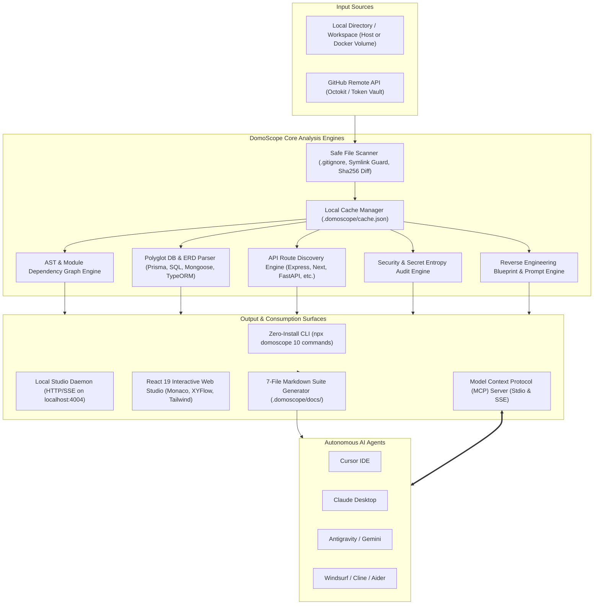
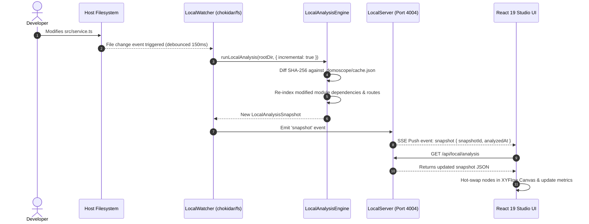

# 01 — System Architecture & Topology

**Status:** Living Document  
**Architectural Style:** Local-First Layered Modular Architecture  
**Runtime Compatibility:** Node.js (>=18), WebGPU Browser, Alpine Docker  

---

## 1. High-Level Architecture Topology

DomoScope is built on a local-first, zero-remote-egress architecture. All AST parsing, database schema inference, and dependency mapping occur on the user's host machine or container.



---

## 2. Core Architectural Subsystems

### 2.1. Ingestion Layer
- **Local Scanner (`src/services/local/localScanner.ts`)**:
  - Traverses directory trees while strictly adhering to root and nested `.gitignore` rules.
  - Enforces `isPathWithinRoot` lexical and realpath symlink containment checks.
  - Skips non-code extensions (images, binaries, fonts, archives, video).
  - Streams SHA-256 hashes per file for incremental diffing.
  - Rejects individual files exceeding 2MB to protect Node memory buffers.
- **Cache Manager (`src/services/local/localCacheManager.ts`)**:
  - Maintains `.domoscope/cache.json`.
  - Reconstructs project state incrementally: unchanged files reuse previously parsed AST nodes, database tables, and API routes.
  - Auto-recovers from corrupted JSON cache files by performing a graceful fallback to a full clean scan.
- **Remote GitHub Client (`src/services/github.ts`)**:
  - Interacts with the GitHub REST API using authenticated octokit sessions.
  - Pulls repository trees and source files on demand with rate limit monitoring.

### 2.2. Processing & Analysis Layer
- **Language & Framework Detector (`src/services/frameworkDetector.ts`)**:
  - Detects 30+ frameworks across frontend (React, Vue, Svelte, Angular, Solid), meta-frameworks (Next.js, Nuxt, Remix, Astro), and backends (FastAPI, Django, Express, NestJS, Spring Boot, Rails, Gin, Fiber).
- **Dependency Graph Engine (`src/services/graphBuilder.ts`)**:
  - Analyzes ES import/export statements, dynamic imports, CommonJS requires, and language-specific imports.
  - Computes directed acyclic graphs (DAGs), in-degree/out-degree counts, and architectural hubs.
- **Polyglot Database Parser (`src/services/databaseParser.ts`)**:
  - Deterministically parses Prisma schemas, raw SQL DDL (PostgreSQL, MySQL, SQLite), Mongoose models, and TypeORM entities into normalized entity definitions.
- **API Route Catalog (`src/services/apiRouteCatalog.ts`)**:
  - Identifies REST endpoints, HTTP methods, and source code line numbers across 8 major backend ecosystems.
- **Security Auditor (`src/services/securityScanner.ts`)**:
  - Evaluates code for leaked cloud credentials, private keys, database connection URIs, and known vulnerability patterns.
- **Reverse Engineering Synthesizer (`src/services/reverseEngineerGenerator.ts`)**:
  - Automatically reconstructs component hierarchies, data flows, and phased rebuilding blueprints for developers and AI agents.

### 2.3. Presentation & Serving Layer
- **CLI (`bin/domoscope.js`, `src/services/local/localCli.ts`)**:
  - Native zero-install command-line interface with 9 subcommands (`init`, `analyze`, `graph`, `docs`, `skill`, `serve`, `watch`, `mcp`, `doctor`).
- **MCP Server (`bin/domoscope-mcp.js`, `src/services/mcpCore.ts`)**:
  - Model Context Protocol server exposing 16 registered tools and 3 prompts over stdio JSON-RPC and HTTP/SSE.
- **Local Studio Server (`src/services/local/localServer.ts`)**:
  - Lightweight Node HTTP server serving the compiled React 19 UI, handling REST API requests (`/api/local/*`), and broadcasting live SSE change events (`/api/local/events`).
- **Web Studio (`src/pages/Workspace.tsx`)**:
  - Single-page client featuring React 19, `@xyflow/react` node graph canvas, Monaco code editor, and WebLLM client-side inference.

---

## 3. Data Contracts & State Schemas

The central unit of architectural memory is the `LocalAnalysisSnapshot`:

```typescript
export interface LocalAnalysisSnapshot {
  snapshotId: string;
  analyzedAt: string;
  projectName: string;
  rootDir: string;
  durationMs: number;
  isIncremental: boolean;
  metadata: {
    name: string;
    description: string;
    defaultBranch: string;
    isPrivate: boolean;
  };
  stats: {
    totalFiles: number;
    totalDirs: number;
    totalLines: number;
    totalBytes: number;
  };
  frameworks: {
    primary: { name: string; category: string; confidence: number };
    secondary: Array<{ name: string; category: string }>;
    allDetected: string[];
  };
  cloudServices: {
    detected: string[];
    services: Array<{ name: string; category: string; file: string }>;
  };
  graph: {
    nodes: Array<{
      id: string;
      data: {
        label: string;
        category: string;
        path: string;
        importedByCount: number;
        importsCount: number;
        lineCount: number;
      };
    }>;
    edges: Array<{
      id: string;
      source: string;
      target: string;
    }>;
  };
  database: {
    detectedTypes: string[];
    tables: Array<{
      name: string;
      sourceFile: string;
      schemaType: string;
      columns: Array<{
        name: string;
        type: string;
        isPrimary: boolean;
        isForeignKey: boolean;
        isNullable: boolean;
        references?: { table: string; column: string };
      }>;
    }>;
    relationships: Array<{
      fromTable: string;
      fromColumn: string;
      toTable: string;
      toColumn: string;
    }>;
  };
  apiRoutes: Array<{
    method: 'GET' | 'POST' | 'PUT' | 'DELETE' | 'PATCH' | 'ALL';
    path: string;
    file: string;
    line: number;
    framework: string;
  }>;
  securityFindings: Array<{
    id: string;
    severity: 'critical' | 'high' | 'medium' | 'low';
    category: string;
    title: string;
    explanation: string;
    file: string;
    line: number;
    suggestedAction: string;
  }>;
  reverseEngineer: {
    overview: string;
    phases: Array<{
      phaseNumber: number;
      title: string;
      objective: string;
      tasks: string[];
    }>;
    subagentPrompts: Array<{
      role: string;
      prompt: string;
    }>;
  };
}
```

---

## 4. Live Event Flow (Watch & Studio Mode)


